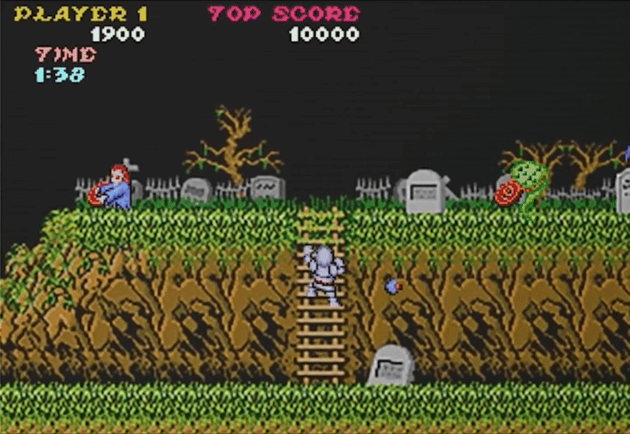

<!-- GENERAL GAME INFO -->

  <h2 align="center">Ghosts'n Goblins</h2>

  
   A C++ recreation of Capcom's Ghosts 'n Goblins, developed as part of my Game Development course at Howest DAE using SDL and the university's custom game engine.  

  

   

   <a href="https://www.youtube.com/watch?v=4ZxlZoO_EGk"> <strong> Watch the full gameplay video »</strong>  </a>

<!-- OVERVIEW -->
## Overview
Ghosts 'n Goblins is a run-and-gun platform game developed by Capcom, where the player controls Sir Arthur as he fights through hordes of enemies to rescue Princess Prin-Prin.

For this project, I recreated the game's core gameplay and mechanics using C++, SDL, and Howest DAE's custom game engine.

<!-- TECHNOLOGIES -->
## Technologies

- C++
- SDL
- X Custom Game Engine
- Visual Studio 2022
- Git

<!-- FEATURES -->
## Features

### Gameplay
- Player movement, jumping, crouching, and climbing
- Weapon and projectile system
- Moving platforms
- Camera movement
- Ladder climbing
- Water hazards
- Boss fight
- Key-based level progression

### Enemies

Implemented 6 enemy types:

- Zombie
- Plant Shooter
- Bird
- Shield Bearer
- Devil
- Boss

### Collectables

- Coins: 200 points
- Money Bags: 500 points
- Balls: 10,000 points
- Enemy drop system with randomized rewards
- Key collectible for completing the level

### UI

- Score counter
- Timer

<!-- TECHNICAL HIGHLIGHTS -->
## Technical Highlights

### Object Composition

Used object composition to manage projectile behaviour.

The player, plants, devils, and boss dynamically create and manage their respective projectile objects. 
Projectiles handle their own updates and collision behaviour before being removed when their lifetime ends or they collide with an object.

### Inheritance

Implemented inheritance for enemies and collectables using base
classes:

**Enemy**
- Zombie
- Bird
- Plant
- Shield Bearer
- Devil
- Boss

**Collectable**
- BallCollectable
- CoinCollectable
- MoneyBag
- KeyCollectable
- EnemyCollectable

### Enemy Drop System

Enemies have a chance to drop a collectable when defeated. The resulting collectable is determined through an additional randomized selection system.

### Boss Level Interaction

The boss requires access to level geometry for collision handling. 
Because the base `Enemy` class does not require level vertices, the relevant level data is provided to the boss during construction rather than modifying the shared `Enemy::Update()` interface.

<!-- MY CONTRIBUTION -->
## My Contribution

I implemented the gameplay systems and mechanics for the project, including:

- Player movement and animations
- Camera movement
- Enemy behaviour
- Projectile systems
- Collision handling
- Moving platforms
- Ladder mechanics
- Collectables and randomized enemy drops
- Boss fight
- Level progression
- Score and timer UI

<!-- CONTROLS -->
## Controls

| Action | Key |
|---|---|
| Move Left | A |
| Move Right | D |
| Climb Up | W |
| Crouch / Climb Down | S |
| Jump | Space |
| Shoot | E |

<!-- GETTING STARTED -->
## Getting Started

### Prerequisites

- Visual Studio 2022

### Running from Visual Studio

1. Open the project folder.
2. Open the `.sln` file.
3. Set `GhostAndGoblins` as the startup project.
4. Build and run the project.

### Running the executable

1. Navigate to the `x64` build folder.
2. Open the appropriate configuration folder.
3. Run `GhostsAndGoblins.exe`.

<!-- WHAT I LEARNED -->
## What I Learned

This project gave me experience working with an existing game-engine architecture and implementing gameplay systems in C++. 
In particular, I gained experience with object-oriented design, inheritance, composition, collision handling, entity management, and integrating multiple gameplay systems into a complete playable level.	
I gained experience with object-oriented design, inheritance, composition, collision handling, entity management, and integrating multiple gameplay systems into a complete playable level.

<!-- CONTACT -->
## Contact

Email: ivaxppetrova@gmail.com
Linkedin: [https://www.linkedin.com/in/ivappetrova/](https://www.linkedin.com/in/ivappetrova/)

<!-- CREDITS -->
## Acknowledgments

* [cppreference](https://en.cppreference.com/w/cpp/container/vector)
* [Website game used for reference](https://online.oldgames.sk/play/arcade/ghosts-n-goblins/10197)
* [Video used for reference](https://www.youtube.com/watch?v=P1VwMYwp80w)

(<a href="#readme-top">back to top</a>)
